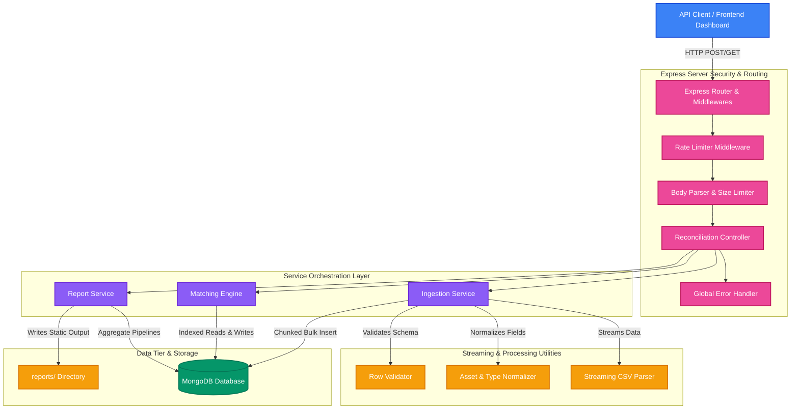
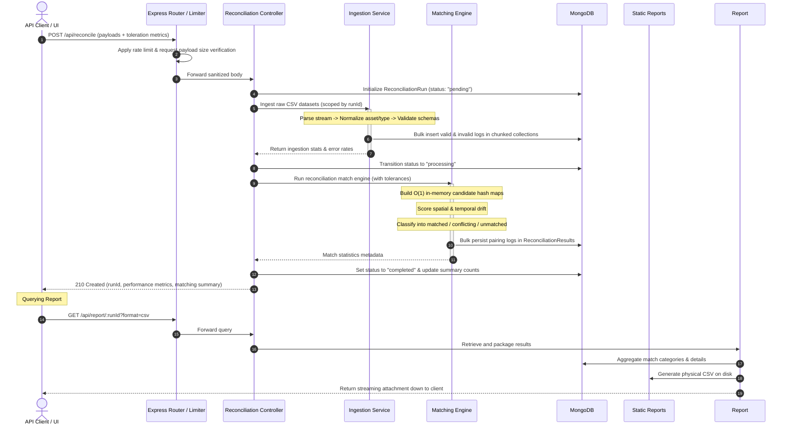
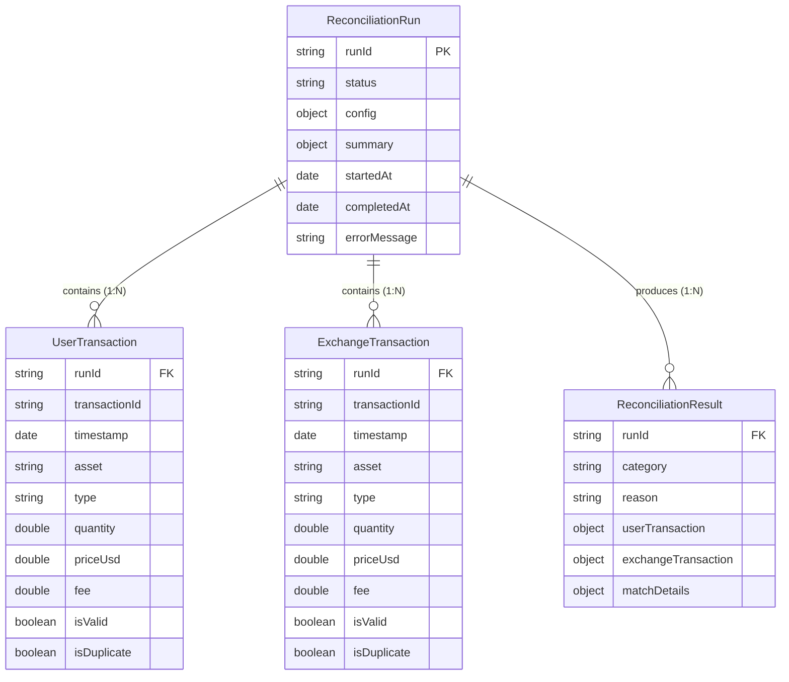

# KoinX Crypto Transaction Reconciliation Engine

An enterprise-grade, high-performance **transaction reconciliation backend** designed to ingest, clean, normalize, and match user-submitted self-reported cryptocurrency transactions against official exchange ledgers. It leverages a score-based greedy algorithm to analyze transactions within configurable tolerances, detects pricing/fee mismatches, and outputs granular diagnostic audit logs.

## Problem Statement

Cryptocurrency tracking, tax auditing, and portfolio management are plagued by fragmented data. Users maintain private records (self-reported) while exchanges record official receipts. Because of network latencies, different decimal precision policies, localized transaction naming conventions (e.g., `bitcoin` vs. `BTC`), and opposing ledger perspectives (`TRANSFER_OUT` from a user's wallet is recorded as `TRANSFER_IN` by the receiving exchange), simple string or equality joins are insufficient. 

Manual reconciliation of these data sources is error-prone, labor-intensive, and fails at scale.


## Features

* 🚀 **Streaming CSV Ingestion Engine**: Built with a memory-efficient stream parser (`csv-parser`) capable of processing large-scale ledgers without consuming high Heap memory.
* 🧠 **Score-Based Greedy Matcher**: Implements an $O(N + M)$ hash-map indexed match strategy that scores temporal/quantitative discrepancies, preventing traditional $O(N \times M)$ performance traps.
* 🔍 **Comprehensive Conflict Isolation**: Detects price discrepancies, fee drift, duplicate records, and unmatched orphans, marking them with exact validation error traces.
* 📦 **Fully Isolated Execution Scope**: Each request generates a unique `runId` that guarantees isolated pipelines, preventing cross-tenant or concurrent-run data leaks.
* 📊 **Granular Diagnostic Logging**: Generates detailed match logs specifying exactly why a transaction failed to pair (e.g., temporal drift out of bounds, quantitative variance exceeded, or total lack of candidate peers).
* 🛡️ **Production-Grade Resilience**: Built-in rate limiting, global structured exception handling, request size limits, and asynchronous router management (Express 5.x native).


## System Architecture



### Technical Design Choices:
* **Decoupled Service Model**: The controller handles network protocol validation while logic is fully isolated into single-responsibility services (`IngestionService`, `MatchingEngine`, `ReportService`).
* **RAM-Efficient Parser**: Streams data row-by-row and flushes blocks of 500 records to MongoDB using `insertMany` with unordered executions, reducing active runtime memory overhead to under 50MB.

---

## Workflow / Request Lifecycle

The sequential lifecycle of a single `/api/reconcile` POST request:



---

## Core Engine Explanation

The matching framework uses a **Score-Based Greedy Algorithm** optimized to run at high speed. 

```
                       [ Incoming User Transaction ]
                                     │
                        (Hash Lookup: Asset + Type)
                                     │
                   ┌─────────────────┴─────────────────┐
          [ Matching Candidates ]             [ Empty Candidate Array ]
                   │                                   │
         (Apply Distance Filters)                      │
     - Timestamp Diff <= Max Drift                     ▼
     - Quantity Diff <= Max Var              Diagnose: "NO_CANDIDATES"
                   │
                   ▼
     (Calculate Match Scores)
     Score = 0.5 * (TimeDiff/Max) 
           + 0.5 * (QtyDiff/Max)
                   │
                   ▼
     (Greedy Pairing Selection)
   - Sort by lowest distance score
   - Select absolute best matching node
   - Lock node in set (one-to-one lock)
                   │
         ┌─────────┴─────────┐
         ▼                   ▼
    [ Match Found ]     [ No Candidate Meets Tolerances ]
         │                   │
  Compare Price/Fee          ▼
   - Identical: MATCHED     Diagnose: "OUT_OF_TOLERANCE"
   - Drifted: CONFLICTING
```

### Internal Engine Dynamics

1. **Hash Index Creation**:
   Instead of checking every User Transaction against every Exchange Transaction (which degrades at $O(U \times E)$), the engine partitions the exchange records in memory using a highly optimized Hash Index Map:
   $$\text{Key} = \text{NormalizedAsset} \mathbin{\Vert} \text{NormalizedEquivalentType}$$
   This reduces candidate lookup complexity to $O(1)$.

2. **Temporal & Quantitative Score Formulation**:
   Each valid candidate is graded by a combined normalized distance score:
   $$\text{Score} = 0.5 \times \left( \frac{\Delta t}{\text{TimestampTolerance}} \right) + 0.5 \times \left( \frac{\Delta q}{\text{QuantityTolerance}} \right)$$
   *Lower scores represent tighter matches.* This ensures that a candidate that has a slight time drift but exact quantity is selected over a candidate with high drift and high quantitative mismatch.

3. **Classification & Conflict Diagnostics**:
   * **Matched**: The candidates fall within tolerance boundaries, and secondary parameters (`priceUsd` and `fee`) match exactly.
   * **Conflicting**: The candidates fall within spatial tolerances, but secondary values (`priceUsd` or `fee`) deviate, signaling data mismatch or unreported fees.
   * **Unmatched (Orphans)**: When no viable candidate fits or survives the maximum tolerance window, the records are classified as unmatched, and the engine logs detailed audit traces (e.g. `TIME_DRIFT_EXCEEDED`, `QUANTITY_MISMATCH`, or `NO_VIABLE_CANDIDATE`).


---

## API Design

The API is built using **RESTful conventions** with clear JSON structures and robust parameter validation.

### Versioning Strategy
Current API endpoints are prefixed with `/api` to maintain simple, extensible routing. If breaking architectural changes occur, routing easily scales to `/api/v1` and `/api/v2` namespace directories.

### Authentication Flow
Designed to easily integrate with standard JWT middleware. The core routing can be wrapped inside an `authMiddleware` to read and decode a bearer token (`Authorization: Bearer <JWT>`), mapping records directly to a client tenant ID.

### Error Response Format
All endpoint failures return a consistent, developer-friendly structured JSON body:

```json
{
  "success": false,
  "error": "BAD_REQUEST",
  "message": "Required parameters 'userCsvContent' and 'exchangeCsvContent' are missing from the request body."
}
```

### Rate Limiting
Configured using a custom sliding-window mechanism (in `middlewares/rateLimiter.ts`) that limits external clients to **100 requests per 15 minutes** per IP address. When exceeded, the system responds with:
* HTTP Status `429 Too Many Requests`
* Header `Retry-After` specifying wait times.

---

## Database Design



### Indexing Strategy
To ensure optimal performance and fast database operations under high concurrent run loads, compound indexes are applied:
1. `UserTransaction` & `ExchangeTransaction`:
   * `{ runId: 1, asset: 1, type: 1, timestamp: 1 }` - Fast query execution path for the Matching Engine.
2. `ReconciliationResult`:
   * `{ runId: 1, category: 1 }` - Enables instant pagination, counts, and exports of specific match classifications.


---

## Scalability & Reliability

* **Horizontal Scale Design**: Since the server is stateless (storing all state details inside MongoDB), you can scale the backend horizontally across multiple containers behind a Round-Robin load balancer (e.g., NGINX, AWS ALB).
* **Robust Failover**: Designed with connection-retries in `config/db.ts` to automatically reconnect to MongoDB if a connection drop is encountered.
* **Health Monitoring**: Dedicated, highly responsive `/health` endpoint exposes immediate application telemetry, reporting runtime status and dynamic server timestamp.

---

## Security

* **CORS Policies**: Restricted whitelist validation prevents script injections from unauthorized browser clients.
* **Input Sanitization**: Rejects malformed JSON and enforces strict payload limits (capped at **20MB** for CSV payloads) to block Buffer Overflow or Denial of Service (DoS) attacks.
* **Secrets Management**: Crucial credentials (such as `MONGODB_URI`) are strictly loaded via runtime environment parameters, never hardcoded inside repositories.

---

## Performance Optimizations

1. **$O(N)$ In-Memory Index Maps**: Instead of running double loops ($O(N^2)$), transactions are mapped into hash tables using their `asset + type` parameters, yielding linear execution speeds.
2. **MongoDB Unordered Bulk Writing**: During stream parsing, records are buffered and processed in bulk using MongoDB's fast unordered pipelines.
3. **Optimized Aggregations**: Summary analytics utilize indexed compound filters, preventing expensive full-table scans.


## Setup Instructions

Follow these steps to run the server locally:

### 1. Prerequisites
Ensure you have **Node.js (v18+)** and **MongoDB** installed and running on your system.

### 2. Install Project Dependencies
```bash
# Clone the repository and navigate to server directory
cd server

# Install the necessary modules
npm install
```

### 3. Setup Environment Configuration
Create a working `.env` by copying the template and supplying your MongoDB and tolerance variables:
```bash
cp .env.example .env # and update PORT, MONGODB_URI, and tolerances as needed
```

### 4. Run the Server
#### Development Mode (With TSX Hot-Reload)
```bash
npm run dev
```

#### Production Build & Execution
```bash
# Compile TypeScript to JavaScript
npm run build

# Boot up production server
npm start
```


## API Examples

### 1. Trigger Reconciliation (`POST /api/reconcile`)

#### Request Body
```json
{
  "userCsvContent": "transactionId,timestamp,type,asset,quantity,priceUsd,fee,note\nUSR-001,2024-03-09T12:00:00Z,BUY,BTC,0.5,30000,10,Standard Buy\nUSR-002,2024-03-09T14:30:00Z,TRANSFER_OUT,ETH,1.2,3500,5,Withdrawal",
  "exchangeCsvContent": "transactionId,timestamp,type,asset,quantity,priceUsd,fee,note\nEXC-001,2024-03-09T12:01:00Z,BUY,BTC,0.50005,30000,10,Match BTC\nEXC-002,2024-03-09T14:31:00Z,TRANSFER_IN,ETH,1.2,3500,5,Match ETH",
  "timestampToleranceSec": 300,
  "quantityTolerancePct": 0.02
}
```

#### Response (`201 Created`)
```json
{
  "success": true,
  "runId": "b1e7f9a2",
  "status": "completed",
  "config": {
    "timestampToleranceSec": 300,
    "quantityTolerancePct": 0.02
  },
  "summary": {
    "matched": 2,
    "conflicting": 0,
    "unmatchedUser": 0,
    "unmatchedExchange": 0,
    "totalProcessed": 2,
    "flaggedRows": {
      "user": 0,
      "exchange": 0
    }
  }
}
```

---

### 2. Retrieve Run Summary (`GET /api/report/:runId/summary`)

#### Request
```http
GET /api/report/b1e7f9a2/summary HTTP/1.1
Host: localhost:3000
```

#### Response (`200 OK`)
```json
{
  "success": true,
  "runId": "b1e7f9a2",
  "summary": {
    "matched": 2,
    "conflicting": 0,
    "unmatchedUser": 0,
    "unmatchedExchange": 0,
    "total": 2
  }
}
```

---

### 3. Get Unmatched Records (`GET /api/report/:runId/unmatched`)

#### Request
```http
GET /api/report/b1e7f9a2/unmatched HTTP/1.1
Host: localhost:3000
```

#### Response (`200 OK`)
```json
{
  "success": true,
  "runId": "b1e7f9a2",
  "unmatched": [
    {
      "category": "unmatched_user",
      "reason": "Exceeded timestamp and quantity tolerances",
      "transaction": {
        "transactionId": "USR-003",
        "timestamp": "2024-03-10T10:00:00.000Z",
        "type": "SELL",
        "asset": "SOL",
        "quantity": 10
      }
    }
  ]
}
```

---

### 4. Download Full Report CSV (`GET /api/report/:runId?format=csv`)

#### Request
```http
GET /api/report/b1e7f9a2?format=csv HTTP/1.1
Host: localhost:3000
```

#### Response Headers
```http
HTTP/1.1 200 OK
Content-Type: text/csv
Content-Disposition: attachment; filename="reconciliation-report-b1e7f9a2.csv"
```


