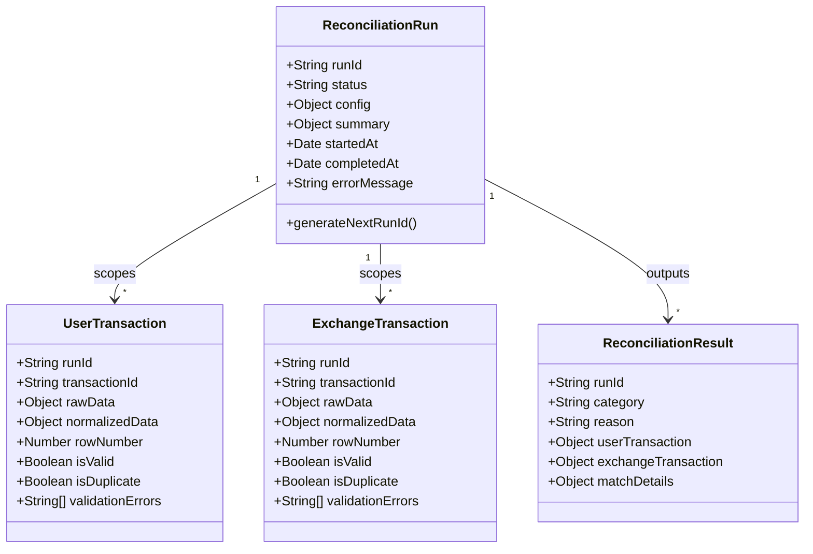

# Database Data Models

This document provides a detailed overview of the four database schemas and models used in the **KoinX Transaction Reconciliation Engine**. All models are implemented in TypeScript using Mongoose.

---

## Model Architecture Diagram



---

## 1. `ReconciliationRun` Model
* **File**: `server/src/models/ReconciliationRun.ts`
* **Collection**: `reconciliation_runs`
* **Purpose**: Metadata ledger that tracks the lifecycle, status, configurations, and summary statistics of each reconciliation job.

### TS Interface:
```typescript
export interface IReconciliationRun {
  runId: string; // Cryptographically secure 8-character hex string (e.g., 3a7f8b2c)
  status: 'pending' | 'processing' | 'completed' | 'failed';
  config: {
    timestampToleranceSec: number;
    quantityTolerancePct: number;
  };
  summary: {
    matched: number;
    conflicting: number;
    unmatchedUser: number;
    unmatchedExchange: number;
    totalProcessed: number;
    flaggedRows: {
      user: number;
      exchange: number;
    };
  };
  startedAt: Date;
  completedAt: Date | null;
  errorMessage: string | null;
}
```
* **Statics**:
  * `generateNextRunId()`: Generates a cryptographically secure, random 8-character hex string (e.g., `3a7f8b2c`).

---

## 2. `UserTransaction` & `ExchangeTransaction` Models
* **Files**: `UserTransaction.ts` and `ExchangeTransaction.ts`
* **Collections**: `user_transactions` and `exchange_transactions`
* **Purpose**: Store raw ingested ledger rows alongside their parsed, type-converted, and normalized values. Keeping them in separate collections ensures indexing isolation and cleaner pipelines.

### TS Interface:
```typescript
export interface ITransaction {
  runId: string;               // Link to the parent ReconciliationRun
  transactionId: string;       // Original transaction code from CSV
  
  // Raw Data (auditing)
  rawTimestamp?: string;
  rawType?: string;
  rawAsset?: string;
  rawQuantity?: string;
  rawPriceUsd?: string;
  rawFee?: string;
  rawNote?: string;

  // Normalized Fields (for engine matching)
  timestamp: Date | null;
  type: string | null;         // BUY, SELL, TRANSFER_IN, TRANSFER_OUT
  asset: string | null;        // Standardized ticker (e.g., BTC, ETH)
  quantity: number | null;
  priceUsd: number | null;
  fee: number;
  note?: string;

  // Data Quality Metrics
  rowNumber: number;           // Index row in raw CSV file
  isValid: boolean;            // Flags validation state
  isDuplicate: boolean;        // True if identical ID+timestamp exists in run
  validationErrors: string[];  // Explanations for invalid rows
}
```

---

## 3. `ReconciliationResult` Model
* **File**: `server/src/models/ReconciliationResult.ts`
* **Collection**: `reconciliation_results`
* **Purpose**: Records matching details of reconciled transaction pairs. It stores full transaction copies as snapshots to ensure report persistence.

### TS Interface:
```typescript
export interface IReconciliationResult {
  runId: string;
  category: 'matched' | 'conflicting' | 'unmatched_user' | 'unmatched_exchange';
  reason: string;              // Human-readable resolution reason
  userTransaction?: any;       // Snapshot copy of UserTransaction (null if exchange unmatched)
  exchangeTransaction?: any;   // Snapshot copy of ExchangeTransaction (null if user unmatched)
  matchDetails?: IMatchDetails | null;
}
```
