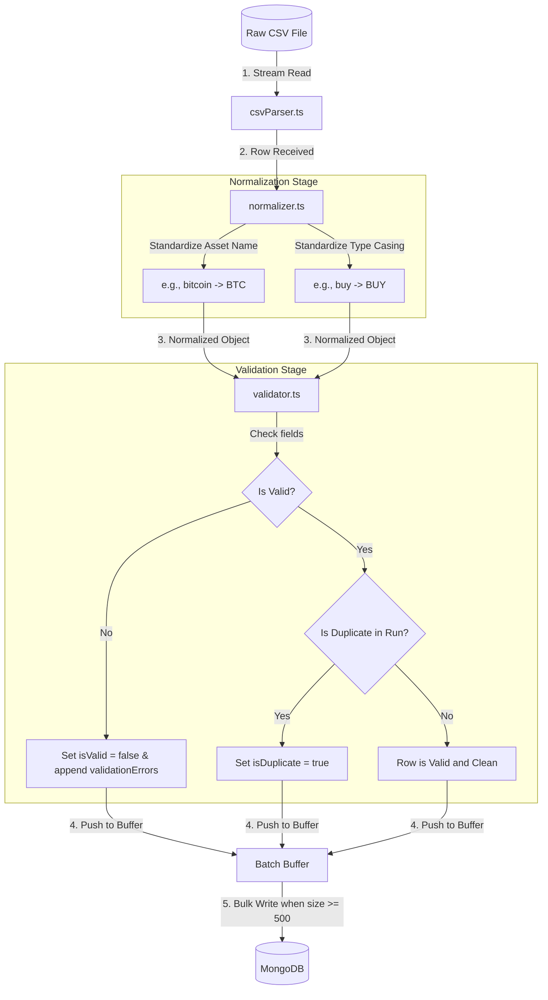

# Transaction Ingestion Pipeline

This document explains how the KoinX transaction ingestion pipeline works under the hood. The pipeline reads user and exchange CSV transaction ledgers, cleanses and validates the data, and stores it in MongoDB.

---

## 1. Pipeline Architecture Diagram

The diagram below shows the flow of a single row through the ingestion pipeline:

---

## 2. Component Directory

The pipeline consists of the following components:

* **Streaming Parser (`server/src/utils/csvParser.ts`)**: Reads raw CSV files line-by-line using Node.js file streams. It pauses the file read stream during database writes or processing to prevent memory usage spikes (backpressure safety).
* **Data Normalizer (`server/src/utils/normalizer.ts`)**: Standardizes input strings:
  * Converts full asset names (like `bitcoin` or `ethereum`) to standard uppercase tickers (`BTC`, `ETH`) using constants mapping.
  * Standardizes transaction type casings.
* **Row Validator (`server/src/utils/validator.ts`)**: Asserts mathematical and structural constraints on each row:
  * Verifies required fields are present.
  * Validates that the timestamp is a parseable date.
  * Ensures transaction types match allowed values (`BUY`, `SELL`, `TRANSFER_IN`, `TRANSFER_OUT`).
  * Ensures quantities and prices are positive numbers.
* **Ingestion Orchestrator (`server/src/services/IngestionService.ts`)**: Pipelines the components together:
  * Coordinates parsing for user and exchange ledgers.
  * Detects duplicate rows (identical `transactionId` + `timestamp` combination within the same execution run).
  * Buffers records in memory and flushes them to MongoDB using `insertMany` in batches of 500.

---

## 3. Data Quality & Error Handling

To ensure auditability, the pipeline **never discards malformed or duplicate rows**. Instead, it saves all raw records while marking their health status:

### A. Invalid Rows (e.g. USR-018)
* **Status**: Saved with `isValid: false`.
* **Details**: The specific parsing failures (e.g. `Malformed or invalid timestamp`, `Quantity must be greater than zero`) are stored inside the `validationErrors` array field on the document.
* **Matching**: Skipped by the matching engine.

### B. Duplicate Rows (e.g. USR-001)
* **Status**: Saved with `isDuplicate: true`.
* **Details**: Marked as duplicate if another transaction with the same ID and timestamp has already been seen in the current `runId`.
* **Matching**: Skipped by the matching engine (only the first valid occurrence is matched).

---

## 4. Performance Optimization

* **Streaming vs. In-Memory**: Instead of loading the entire file into memory, records are processed one by one. Memory consumption remains constant ($<50$MB) regardless of input size.
* **Batch Writes**: Writing to MongoDB in batches of 500 minimizes database network roundtrips.
* **Index-Ready Schema**: Transaction records are stored with compound indexes on `{ runId, asset, type, timestamp }` and `{ runId, isValid, isDuplicate }` to enable instant querying.
