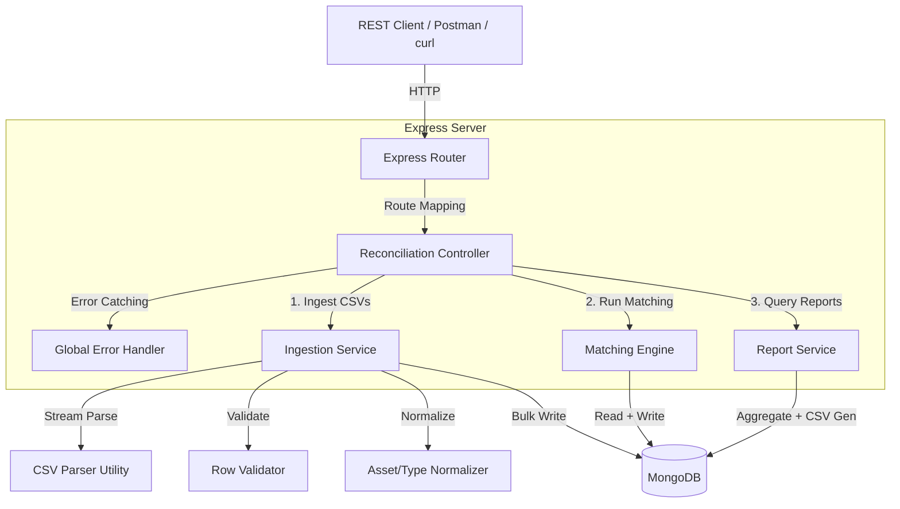
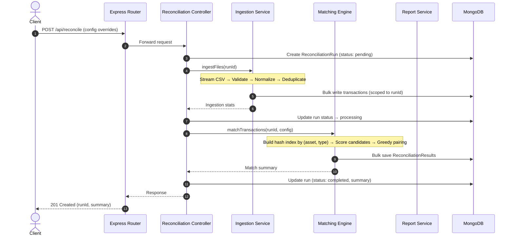

# Production System Design & Implementation Plan: KoinX Transaction Reconciliation Engine

## A. Executive Summary

This document details the production-grade system architecture for the **KoinX Transaction Reconciliation Engine**. The system ingests user-imported and exchange-exported transaction ledgers, normalizes formatting and perspective discrepancies (asset ticker aliases, type direction flips), and performs fuzzy matching across both data sources within configurable tolerances.

### Key Design Decisions:
- **Run Isolation**: Every reconciliation execution is scoped to a unique `runId`. Transactions and results are stored per-run, preventing data leaks between concurrent requests.
- **Optimized Matching**: Index-based hash lookup using JS `Map` structures yields $O(N + M)$ average time complexity instead of naive $O(N \times M)$.
- **Immutable Raw Ledger**: Raw CSV field values are preserved exactly as received alongside normalized values for auditing and troubleshooting.
- **Express v5**: The project uses Express `5.x` (as installed in `package.json`). Route error handling uses native async support — no need for `express-async-errors` wrappers.
- **No `uuid` dependency**: Short 8-character `runId` hashes are generated using Node.js built-in `crypto.randomBytes(4).toString('hex')` — the `uuid` package can be removed.

---

## B. Architecture Diagram

### High-Level System Architecture



### Data Pipeline Flow



---

## C. Database Schema

Four collections, all scoped to a unique `runId`.

### 1. `user_transactions` & `exchange_transactions` Collections

Both collections share the same schema structure.

```javascript
{
  runId: String,                  // Scopes data to a specific run
  transactionId: String,          // Original ID from CSV (e.g. "USR-001")

  // Immutable Raw Data (preserved exactly from CSV)
  rawTimestamp: String,
  rawType: String,
  rawAsset: String,
  rawQuantity: String,
  rawPriceUsd: String,
  rawFee: String,
  rawNote: String,

  // Normalized Fields (used by matching engine)
  timestamp: Date,                // Parsed ISODate, null if invalid
  type: String,                   // Uppercase: BUY, SELL, TRANSFER_IN, TRANSFER_OUT
  asset: String,                  // Canonical ticker: bitcoin → BTC
  quantity: Number,               // Parsed float
  priceUsd: Number,               // Parsed float
  fee: Number,                    // Parsed float, defaults to 0
  note: String,

  // Data Quality
  rowNumber: Number,              // CSV line number for traceability
  isValid: Boolean,               // false if validation failed
  isDuplicate: Boolean,           // true if duplicate ID+timestamp in same run
  validationErrors: [String]      // Reasons: ["Malformed timestamp", "Negative quantity"]
}
```

**Indexes**:
- `{ runId: 1, asset: 1, type: 1, timestamp: 1 }` — Compound index for fast candidate matching
- `{ runId: 1, isValid: 1, isDuplicate: 1 }` — Filter index for clean data retrieval

### 2. `reconciliation_runs` Collection

```javascript
{
  runId: String,                  // Incremental sequence ID (e.g. "RUN-0001")
  status: String,                 // "pending" | "processing" | "completed" | "failed"
  config: {
    timestampToleranceSec: Number,
    quantityTolerancePct: Number
  },
  summary: {
    matched: Number,
    conflicting: Number,
    unmatchedUser: Number,
    unmatchedExchange: Number,
    totalProcessed: Number,
    flaggedRows: {
      user: Number,
      exchange: Number
    }
  },
  startedAt: Date,
  completedAt: Date,
  errorMessage: String
}
```

**Indexes**:
- `{ runId: 1 }` — Unique index

### 3. `reconciliation_results` Collection

```javascript
{
  runId: String,
  category: String,               // "matched" | "conflicting" | "unmatched_user" | "unmatched_exchange"
  reason: String,                 // Human-readable explanation

  userTransaction: Object,        // Embedded snapshot (null if exchange-only unmatched)
  exchangeTransaction: Object,    // Embedded snapshot (null if user-only unmatched)

  matchDetails: {                 // null for unmatched entries
    timestampDiffSec: Number,
    quantityDiffPct: Number,
    matchScore: Number,
    fieldsCompared: {
      type:     { user: String, exchange: String, match: Boolean },
      asset:    { user: String, exchange: String, match: Boolean },
      quantity: { user: Number, exchange: Number, match: Boolean, diffPct: Number },
      priceUsd: { user: Number, exchange: Number, match: Boolean },
      fee:      { user: Number, exchange: Number, match: Boolean }
    }
  }
}
```

**Indexes**:
- `{ runId: 1, category: 1 }` — Compound index for filtered report queries

---

## D. API Design

All endpoints are under the `/api` prefix. Matching the assignment specification exactly.

### Endpoint Mappings

| Method | Endpoint | Description |
|--------|----------|-------------|
| `POST` | `/api/reconcile` | Trigger reconciliation (accepts optional config overrides) |
| `GET`  | `/api/report/:runId` | Full reconciliation report. `?format=csv` for CSV download |
| `GET`  | `/api/report/:runId/summary` | Summary counts only |
| `GET`  | `/api/report/:runId/unmatched` | Unmatched rows with reasons |

#### `POST /api/reconcile`
- **Request Body** (all fields optional — overrides env defaults):
```json
{
  "timestampToleranceSec": 300,
  "quantityTolerancePct": 0.01
}
```
- **Response `201 Created`**:
```json
{
  "success": true,
  "runId": "RUN-0001",
  "status": "completed",
  "config": {
    "timestampToleranceSec": 300,
    "quantityTolerancePct": 0.01
  },
  "summary": {
    "matched": 17,
    "conflicting": 2,
    "unmatchedUser": 3,
    "unmatchedExchange": 2,
    "totalProcessed": 24,
    "flaggedRows": { "user": 3, "exchange": 0 }
  }
}
```

#### `GET /api/report/:runId/summary`
- **Response `200 OK`**:
```json
{
  "success": true,
  "runId": "RUN-0001",
  "summary": {
    "matched": 17,
    "conflicting": 2,
    "unmatchedUser": 3,
    "unmatchedExchange": 2,
    "total": 24
  }
}
```

#### `GET /api/report/:runId/unmatched`
- **Response `200 OK`**:
```json
{
  "success": true,
  "runId": "RUN-0001",
  "unmatched": [
    {
      "category": "unmatched_exchange",
      "reason": "No matching user transaction found",
      "transaction": {
        "transactionId": "EXC-1024",
        "timestamp": "2024-03-13T18:00:00.000Z",
        "type": "BUY",
        "asset": "ETH",
        "quantity": 0.6
      }
    }
  ]
}
```

### Error Response Format
```json
{
  "success": false,
  "error": "Run not found",
  "message": "No reconciliation run found with ID: invalid-id"
}
```

---

## E. Folder Structure

Simplified for this project scope — no unnecessary abstraction layers.

```
KoinX_Assegment/
├── data/
│   ├── user_transactions.csv
│   └── exchange_transactions.csv
└── server/
    ├── .env
    ├── .env.example
    ├── .gitignore
    ├── package.json
    ├── reports/                        # Generated CSV reports (auto-created)
    └── src/
        ├── server.js                   # Express app + DB connect + start listener
        ├── config/
        │   ├── db.js                   # MongoDB connection with retry
        │   └── constants.js            # Aliases, type maps, default tolerances
        ├── models/
        │   ├── UserTransaction.js
        │   ├── ExchangeTransaction.js
        │   ├── ReconciliationRun.js
        │   └── ReconciliationResult.js
        ├── controllers/
        │   ├── reconciliationController.js  # POST /reconcile handler
        │   └── reportController.js          # GET /report handlers
        ├── routes/
        │   └── reconciliationRoutes.js      # Route definitions
        ├── middlewares/
        │   ├── errorHandler.js              # Global error handler
        │   └── rateLimiter.js               # API rate limiting
        ├── services/
        │   ├── IngestionService.js           # CSV → validate → normalize → store
        │   ├── MatchingEngine.js             # Hash index matching + scoring
        │   └── ReportService.js              # Report queries + CSV generation
        └── utils/
            ├── csvParser.js                 # Streaming CSV parser wrapper
            ├── validator.js                 # Row-level validation rules
            └── normalizer.js                # Asset alias + type normalization
```

**What was removed and why:**
- `requestValidator.js` — Simple validation is done directly in the controller. No need for a separate middleware for 4 endpoints.
- `logger.js` — `console.log` with clear prefixes is sufficient for this scope.

---

## F. Edge Cases Table

| # | Edge Case | Handling Strategy |
|---|-----------|-------------------|
| 1 | **Duplicate rows** (USR-001 appears twice, row 2 & 17) | Detect by `transactionId + timestamp` combo. First occurrence is valid, subsequent marked `isDuplicate: true` |
| 2 | **Malformed timestamp** (`2024-03-09T` — USR-018) | `new Date()` returns Invalid Date → `isValid: false`, skip from matching |
| 3 | **Negative quantity** (`-0.1` — USR-019) | Validation check `qty <= 0` → `isValid: false`, skip from matching |
| 4 | **Missing fields** (USR-024: no timestamp, no type) | Each missing field appended to `validationErrors[]`, row stored with `isValid: false` |
| 5 | **Asset aliases** (`bitcoin` instead of `BTC` — USR-005) | Normalizer converts via alias map: `bitcoin → BTC`, `ethereum → ETH`, etc. |
| 6 | **Type perspective flips** (`TRANSFER_OUT` ↔ `TRANSFER_IN`) | Matching engine checks both direct type match AND equivalent type via `TYPE_EQUIVALENCES` map |
| 7 | **Timestamp drift** (up to 55s observed — EXC-1007) | Configurable tolerance window (default 300s) |
| 8 | **Quantity rounding** (0.3 vs 0.3001 — EXC-1012) | Percentage diff formula: `abs(q1-q2)/q1 * 100 <= tolerancePct` |
| 9 | **Fee mismatch** (0.0015 vs 0.002 — USR-010/EXC-1010) | Detected during field comparison → category set to `conflicting` |
| 10 | **Exchange-only transactions** (EXC-1024, EXC-1025) | Remaining after matching → `unmatched_exchange` |
| 11 | **Multiple match candidates** | Score each by `(timeDiff/maxTime)*0.5 + (qtyDiff/maxQty)*0.5`, pick lowest score |
| 12 | **One-to-many prevention** | Greedy: matched exchange IDs tracked in a `Set`, cannot be reused |
| 13 | **Empty/whitespace-only rows** | Detected during CSV parsing, skipped silently |
| 14 | **Missing CSV files** | `fs.existsSync()` check before streaming, throw descriptive error |

---

## G. Scalability Notes

1. **Streaming Ingestion**: `csv-parser` streams rows line-by-line. Rows are buffered (batch size ~500) then bulk-written to MongoDB. Memory stays under 50MB even for million-row files.

2. **Hash-Index Matching**: Exchange transactions are grouped into a `Map<"ASSET_TYPE", Transaction[]>`. For each user transaction, candidate lookup is $O(1)$. Scoring within the candidate list is $O(K)$ where K is typically small (same asset+type).

3. **Database Indexes**: Compound indexes on `{ runId, asset, type, timestamp }` ensure MongoDB queries during matching are index-covered.

---

## H. Implementation Roadmap

### Milestone 1: Core Framework & Database Models
- `server.js` — Express app + MongoDB connection + start listener (single entry point)
- `config/db.js` — MongoDB connection
- `config/constants.js` — Asset aliases, type equivalences, default tolerances
- All 4 Mongoose models with indexes

### Milestone 2: Ingestion Pipeline
- `utils/csvParser.js` — Streaming CSV parser
- `utils/validator.js` — Row validation rules
- `utils/normalizer.js` — Asset/type normalization
- `services/IngestionService.js` — Full pipeline orchestrator

### Milestone 3: Matching Engine & Reports
- `services/MatchingEngine.js` — Hash-index matching, scoring, conflict detection
- `services/ReportService.js` — Report queries, CSV export

### Milestone 4: API Layer & Verification
- `routes/reconciliationRoutes.js` — 4 endpoints
- `controllers/reconciliationController.js` — Request handling
- `middlewares/errorHandler.js` — Global error handler
- Verify against expected results using curl/Postman

### Milestone 5: Documentation & DevOps
- `README.md` with setup instructions and key design decisions
- `.env.example` template
- Dockerfile + docker-compose
